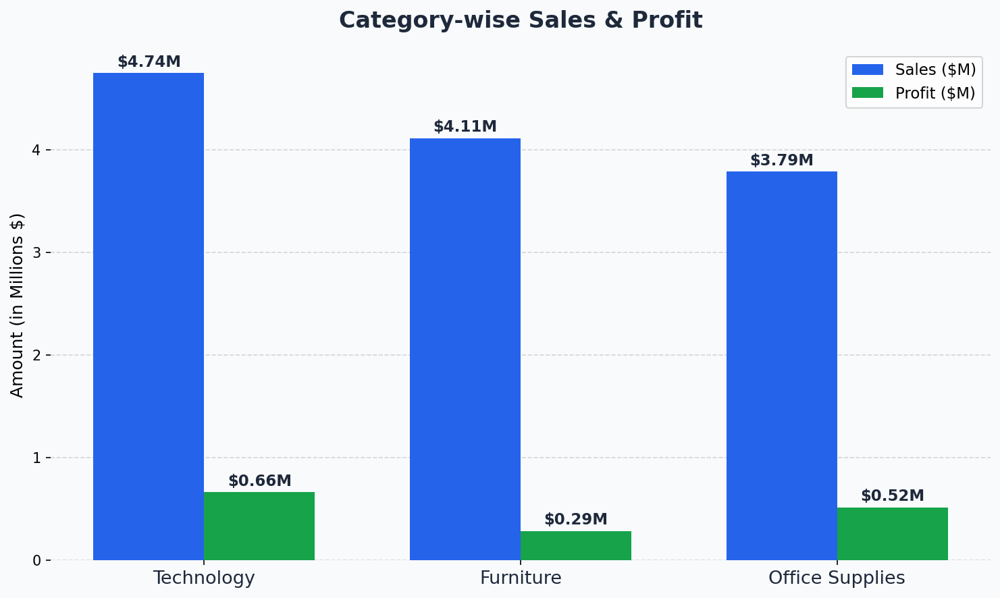
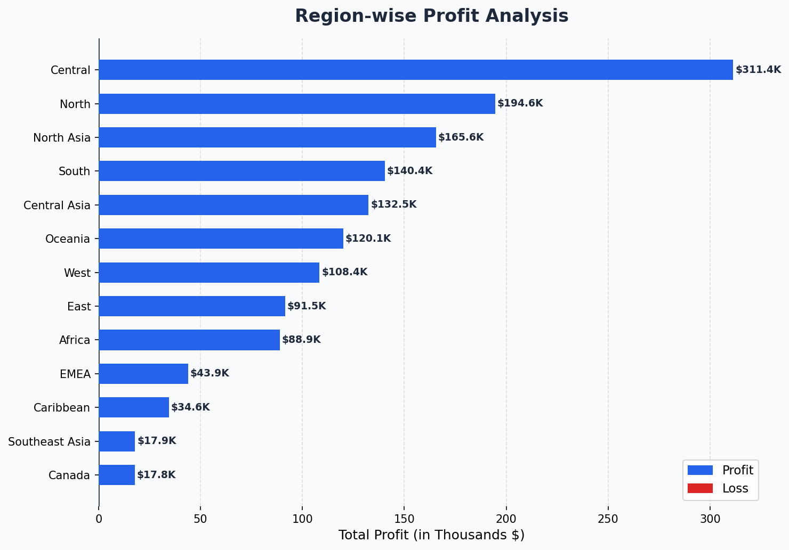
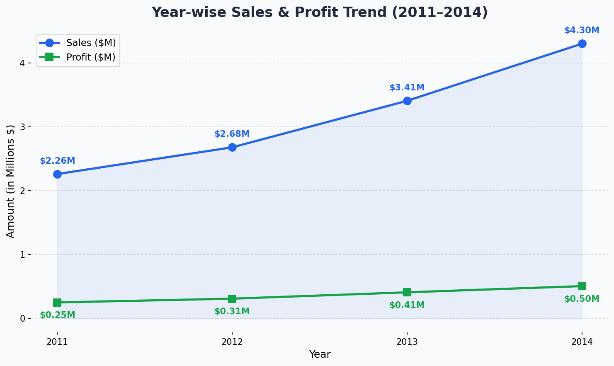
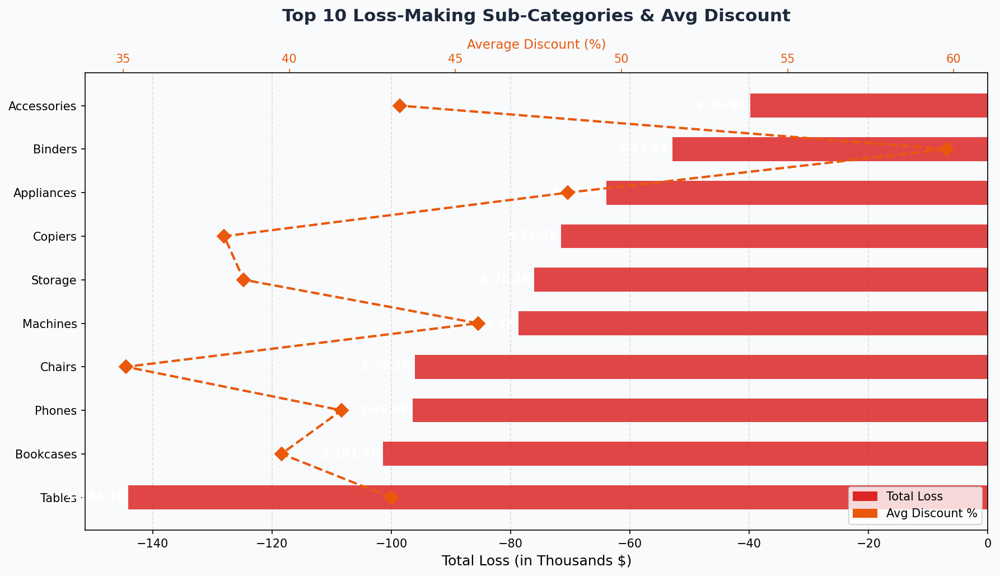
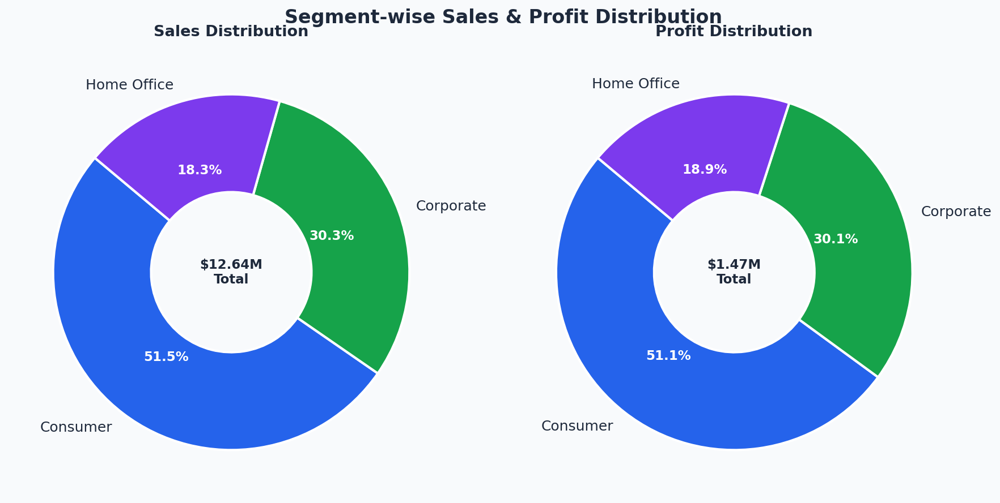
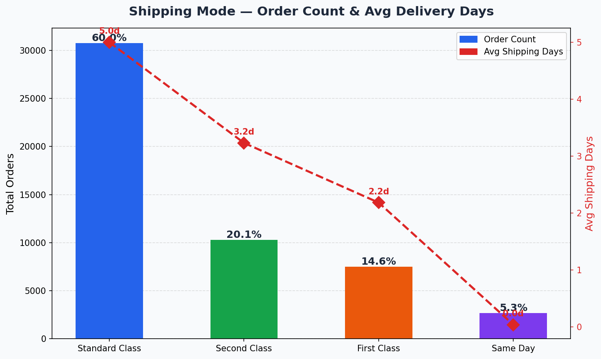

# 🌍 Global Superstore Sales Analysis

## 📌 Project Overview

End-to-end data analysis of **51,290+ global retail orders** across multiple markets, regions, and product categories — covering data cleaning, feature engineering, SQL querying, Excel summaries, Python EDA, and Power BI dashboarding.

---

## 🛠️ Tools & Technologies

| Tool | Purpose |
|------|---------|
| Python (Pandas, Matplotlib, Seaborn) | Data cleaning, EDA, feature engineering, visualization |
| SQL Server | Business queries, KPI extraction, loss analysis |
| Power BI | Interactive dashboard, visual storytelling |
| Excel | Pivot tables — category, region, segment summaries |

---

## 📁 Project Structure


```
Global-Superstore-Analytics/
│
├── Data/
│   ├── Global_Superstore2.csv
│   └── Global_Superstore_Final.csv
│
├── notebooks/
│   └── Global_Superstore_Analysis.ipynb
│
├── sql/
│   └── GlobalStoreDB_Analysis.sql
│
├── excel/
│   └── Global_Superstore_Analysis.xlsx
│
├── dashboards/
│   └── Global_Superstore_Dashboard.pbix
│
├── images/
│
└── README.md
```


---

## 📸 Power BI Dashboard Preview

### Sales Overview


### Detailed Analysis


---

## 📊 Excel Pivot Analysis


### Category wise Sales & Profit


### Region wise Sales & Profit


### Segment wise Sales & Profit


### Ship Mode wise Orders Count


---

## 🐍 Python Charts

### Category-wise Sales & Profit


### Region-wise Profit Analysis


### Year-wise Sales & Profit Trend


### Loss-Making Sub-Categories & Avg Discount


### Segment-wise Distribution


### Shipping Mode Analysis


---

## 🔄 Project Workflow

Raw Data (CSV)
↓
Python — Data Cleaning + Feature Engineering + Visualization
↓
Cleaned CSV → SQL Server → Business Queries
↓
Excel → Pivot Table Summaries
↓
Power BI → Interactive Dashboard

---

## 📊 Key Business Insights

| # | Insight |
|---|---------|
| 1 | 💻 **Technology** is the top revenue category — **$4.74M** in sales |
| 2 | 🪑 **Furniture** has highest avg discount (16.8%) → lowest profit margin |
| 3 | 🌍 **Central** region leads in profit — **$311K** |
| 4 | ⚠️ **Southeast Asia** has 27.2% avg discount → only **$17K** profit |
| 5 | 🔴 **Turkey** is the biggest loss market — **(-$98K)** profit |
| 6 | 📉 **Tables** sub-category carries 29% avg discount → net loss |
| 7 | 🚨 **24.46%** of all orders are loss-making — 1 in every 4 orders! |
| 8 | 🚚 **Standard Class** shipping dominates — **60%** of total orders |

---

## 🗂️ SQL Analysis — 5 Sections

1. **Database Setup** — Create and use `GlobalStoreDB`
2. **Table Creation** — Schema with derived columns (ProfitMargin, IsLoss, ShippingDays)
3. **Data Verification** — Row count + data preview
4. **Business Analysis Queries** — Category, Country (top/loss), Shipping, Loss sub-categories
5. **Key Business Insights** — Summary comments

---

## 🐍 Python Notebook — 8 Sections

1. Data Loading
2. Exploratory Data Analysis (EDA)
3. Data Cleaning
4. Feature Engineering
5. Save Cleaned Data
6. Data Analysis (7 sub-analyses)
7. Data Visualization (6 charts)
8. Key Business Insights

---

## 📦 Dataset

- **Source:** Kaggle — Global Superstore Dataset
- **Rows:** 51,290 orders
- **Columns:** 24 (+ 5 engineered features)
- **Coverage:** Global markets, 2011–2014

---

## 👤 Author

**Imran Makandar**
📧 imranmakandar699423@gmail.com
🔗 [LinkedIn](https://www.linkedin.com/in/imrannoorallimakandar)
🐙 [GitHub](https://github.com/Imran225599)
